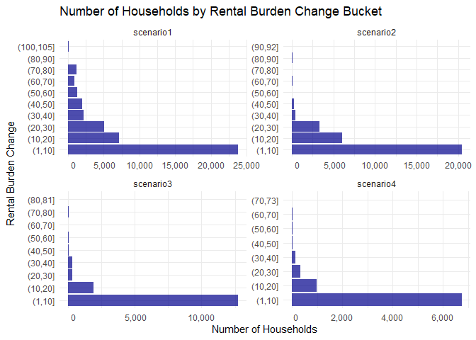
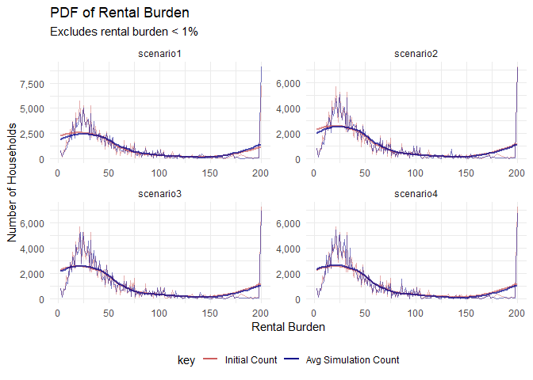

Covid-19 Hawai’i Rental Assistance
================
Isabelle Picciotto

The following analysis of the burden renters will face in HI for the
remainder of 2020 is presented in [this UHERO blog
post](https://uhero.hawaii.edu/?p=8990).

``` r
# Install required packages

# pkgs <- c(
#   "rmarkdown",
#   "tidyverse",
#   "lubridate",
#   "scales",
#   "svMIsc",
#   "gt"
# )
# 
# install.packages(pkgs)
```

``` r
library(rmarkdown)
library(tidyverse)
library(lubridate)
library(scales)
library(svMisc)
library(gt)

options(scipen = 999)
```

### Data Sources

Individual level income and jobs data is sourced from the American
Community Survey (ACS) 2018 IPUMS microdata. Household survey weights
are utilized to scale the 4,800 surveyed households to the 455,000 total
households in the state.

Industry-level job losses for the remainder of 2020 are forecasted by
UHERO. Forecasted losses are randomly assigned to individuals by
industry. We assume that 65% of job losses will be assigned to
individuals who are below the median income of each industry.

### Number of Iterations

``` r
n_iterations <- 100
```

In order to avoid aberrations based on a single random draw, the
analysis is repeated 100 times and the results are averaged over all
simulations.

### UHERO Job Loss Forecasts

``` r
uhero_forecast<-read_csv("data/uhero_jobs_forecast.csv")

### Clean up job columns:
# List of UHERO job mnemonics to retain in the forecast file
job_mnemonics<-c("E", "E_NF", "EGV", "EGVFD", "E_GVSL", "ECT", "EMN", "E_TRADE", "E_TU",
                 "E_FIR", "E_SV", "EHC", "EAF", "E_ELSE")

uhero_jobs<-uhero_forecast %>%
  select(Date, starts_with(job_mnemonics)) %>%
  select(Date, ends_with("(new)"))

# Rename columns
new_colnames<-str_remove_all(string = colnames(uhero_jobs), pattern = "@HI \\(new\\)*")
colnames(uhero_jobs)<-new_colnames

# Create the agricultural job series
uhero_jobs<-uhero_jobs %>%
  mutate(EAG = E - E_NF)

### Calculate year over year job losses by industry
uhero_job_losses<-uhero_jobs %>%
  mutate_at(.vars = vars(-Date), function(x) (x - lag(x, n = 4))*1000) %>%
  mutate_at(.vars = vars(-Date), function(x) if_else(x < 0, abs(x), 0))
```

### ACS (2018) IPUMS Microdata Cleaning

``` r
# Read IPUMS csv file
ipums_raw<-read_csv("data/ACS_2017-2018.csv")

### Filter the IPUMS data 
  # Restrict the sample to include 2018 survey results
  # Remove OWNERSHP = 0, these are neither renter or homeowner households and thus will not be assigned job losses
  # Per the IPUMS Coding Manual, recode NA entries as NA

ipums_2018<-filter(ipums_raw, YEAR == 2018 & OWNERSHP != 0) %>%
  mutate(inc_total = INCTOT %>% na_if(9999999),
         inc_wage = INCWAGE %>% na_if(999999) %>% na_if(999998),
         hh_income = HHINCOME %>% na_if(9999999),
         rent_grs = if_else(OWNERSHP == 2, RENTGRS, NA_real_),
         rent_burden = if_else(rent_grs == 0, 0, pmin(rent_grs/(hh_income/12)*100, 200))) 

### Apply household weightings to the data
  # Duplicate households based on household weight (HHWT)
  # Create a new unique HH identifier for the duplicated households
ipums_weighted<-ipums_2018 %>%
  group_by(SERIAL) %>%
  uncount(weights = HHWT, .id = "ID") %>%
  unite("hhid", c("SERIAL", "ID"), sep = "_", remove = F) %>%
  ungroup() %>%
  group_by(hhid)
```

### Data Cleaning and Joining

In order to assign UHERO job losses to individuals in the ACS (2018)
IPUMS Microdata, the UHERO job industry mnemonics are joined to the ACS
job categories using their Census Code. Original mapping of UHERO
mnemonic to Census Code was done using NAICS codes.

``` r
# Load the industry uhero mnemonic csv file
ind_uhero_match<-read_csv("data/industry_code_uhero_mnemonics.csv")

# Assign the uhero mnemonic to the ipums industry code
ipums_uhero<-left_join(ipums_weighted, ind_uhero_match, by = c("IND" = "2017 Census Code")) %>%
  rowid_to_column(var = "unique_id") %>%
  ungroup()

# Get unique list of industries in the ACS data
jobs<-unique(na.omit(ipums_uhero$UHERO_mnemonic))

# Choose which as of date you want for annual job losses
as_of_date<-"2020-07-01"

uhero_job_loss_reshape<-uhero_job_losses %>%
  pivot_longer(-Date, names_to = "UHERO_mnemonic", values_to = "job_losses") %>%
  filter(Date == as_of_date & UHERO_mnemonic %in% jobs) %>%
  select(-Date)

# Revise the number of job losses to equal the minimum of the total jobs or total job losses
n_jobs<-ipums_uhero %>%
  group_by(UHERO_mnemonic) %>%
  tally() %>%
  na.omit() %>%
  left_join(uhero_job_loss_reshape, by = "UHERO_mnemonic") %>%
  mutate(revised_losses = pmin(n, job_losses)) %>%
  select(-n, -job_losses) %>%
  mutate(n_low = round(revised_losses*0.65),
         n_high = round(revised_losses*0.35))

# Calculate the median individual income for each industry
median_income<-ipums_uhero %>%
  group_by(UHERO_mnemonic) %>%
  summarize(median_income = median(inc_total, na.rm = T)) %>%
  na.omit()

# Add a median income column to the individual level data to determine whether each individual falls into the low/high income category
# Exclude all individuals wtih wage income equal to zero so that they cannot randomly be assigned a job loss
simulation_dataset<-left_join(ipums_uhero, median_income, by = "UHERO_mnemonic") %>%
  mutate(income_cat = case_when(inc_total < median_income & inc_wage != 0 ~ "low",
                                inc_total >= median_income & inc_wage != 0 ~ "high",
                                is.na(UHERO_mnemonic) | inc_wage == 0 ~ "unassigned"))

# Create a table summarizing the UHERO forecasted job categories, number of wage earners per category, and number of forecasted job losses
simulation_dataset %>% 
  left_join(select(n_jobs, revised_losses, UHERO_mnemonic), by = "UHERO_mnemonic") %>% 
  select(unique_id, hhid, inc_wage, hh_income, revised_losses, Industry_Sector, UHERO_mnemonic) %>% 
  filter(!is.na(Industry_Sector)) %>% 
  group_by(UHERO_mnemonic) %>% 
  filter(inc_wage > 0) %>% 
  summarize("Sectors Included" = list(unique(Industry_Sector)), 
            "Number of Wage Earners" = n(), 
            "Annual Job Losses (as of 2020 Q3)" = mean(revised_losses)) %>%
  gt() %>%
  fmt_number(columns = vars("Number of Wage Earners", "Annual Job Losses (as of 2020 Q3)"), decimal = 0)
```

<!--html_preserve-->

<style>html {
  font-family: -apple-system, BlinkMacSystemFont, 'Segoe UI', Roboto, Oxygen, Ubuntu, Cantarell, 'Helvetica Neue', 'Fira Sans', 'Droid Sans', Arial, sans-serif;
}

#cshknzapfj .gt_table {
  display: table;
  border-collapse: collapse;
  margin-left: auto;
  margin-right: auto;
  color: #333333;
  font-size: 16px;
  background-color: #FFFFFF;
  width: auto;
  border-top-style: solid;
  border-top-width: 2px;
  border-top-color: #A8A8A8;
  border-right-style: none;
  border-right-width: 2px;
  border-right-color: #D3D3D3;
  border-bottom-style: solid;
  border-bottom-width: 2px;
  border-bottom-color: #A8A8A8;
  border-left-style: none;
  border-left-width: 2px;
  border-left-color: #D3D3D3;
}

#cshknzapfj .gt_heading {
  background-color: #FFFFFF;
  text-align: center;
  border-bottom-color: #FFFFFF;
  border-left-style: none;
  border-left-width: 1px;
  border-left-color: #D3D3D3;
  border-right-style: none;
  border-right-width: 1px;
  border-right-color: #D3D3D3;
}

#cshknzapfj .gt_title {
  color: #333333;
  font-size: 125%;
  font-weight: initial;
  padding-top: 4px;
  padding-bottom: 4px;
  border-bottom-color: #FFFFFF;
  border-bottom-width: 0;
}

#cshknzapfj .gt_subtitle {
  color: #333333;
  font-size: 85%;
  font-weight: initial;
  padding-top: 0;
  padding-bottom: 4px;
  border-top-color: #FFFFFF;
  border-top-width: 0;
}

#cshknzapfj .gt_bottom_border {
  border-bottom-style: solid;
  border-bottom-width: 2px;
  border-bottom-color: #D3D3D3;
}

#cshknzapfj .gt_col_headings {
  border-top-style: solid;
  border-top-width: 2px;
  border-top-color: #D3D3D3;
  border-bottom-style: solid;
  border-bottom-width: 2px;
  border-bottom-color: #D3D3D3;
  border-left-style: none;
  border-left-width: 1px;
  border-left-color: #D3D3D3;
  border-right-style: none;
  border-right-width: 1px;
  border-right-color: #D3D3D3;
}

#cshknzapfj .gt_col_heading {
  color: #333333;
  background-color: #FFFFFF;
  font-size: 100%;
  font-weight: normal;
  text-transform: inherit;
  border-left-style: none;
  border-left-width: 1px;
  border-left-color: #D3D3D3;
  border-right-style: none;
  border-right-width: 1px;
  border-right-color: #D3D3D3;
  vertical-align: bottom;
  padding-top: 5px;
  padding-bottom: 6px;
  padding-left: 5px;
  padding-right: 5px;
  overflow-x: hidden;
}

#cshknzapfj .gt_column_spanner_outer {
  color: #333333;
  background-color: #FFFFFF;
  font-size: 100%;
  font-weight: normal;
  text-transform: inherit;
  padding-top: 0;
  padding-bottom: 0;
  padding-left: 4px;
  padding-right: 4px;
}

#cshknzapfj .gt_column_spanner_outer:first-child {
  padding-left: 0;
}

#cshknzapfj .gt_column_spanner_outer:last-child {
  padding-right: 0;
}

#cshknzapfj .gt_column_spanner {
  border-bottom-style: solid;
  border-bottom-width: 2px;
  border-bottom-color: #D3D3D3;
  vertical-align: bottom;
  padding-top: 5px;
  padding-bottom: 6px;
  overflow-x: hidden;
  display: inline-block;
  width: 100%;
}

#cshknzapfj .gt_group_heading {
  padding: 8px;
  color: #333333;
  background-color: #FFFFFF;
  font-size: 100%;
  font-weight: initial;
  text-transform: inherit;
  border-top-style: solid;
  border-top-width: 2px;
  border-top-color: #D3D3D3;
  border-bottom-style: solid;
  border-bottom-width: 2px;
  border-bottom-color: #D3D3D3;
  border-left-style: none;
  border-left-width: 1px;
  border-left-color: #D3D3D3;
  border-right-style: none;
  border-right-width: 1px;
  border-right-color: #D3D3D3;
  vertical-align: middle;
}

#cshknzapfj .gt_empty_group_heading {
  padding: 0.5px;
  color: #333333;
  background-color: #FFFFFF;
  font-size: 100%;
  font-weight: initial;
  border-top-style: solid;
  border-top-width: 2px;
  border-top-color: #D3D3D3;
  border-bottom-style: solid;
  border-bottom-width: 2px;
  border-bottom-color: #D3D3D3;
  vertical-align: middle;
}

#cshknzapfj .gt_striped {
  background-color: rgba(128, 128, 128, 0.05);
}

#cshknzapfj .gt_from_md > :first-child {
  margin-top: 0;
}

#cshknzapfj .gt_from_md > :last-child {
  margin-bottom: 0;
}

#cshknzapfj .gt_row {
  padding-top: 8px;
  padding-bottom: 8px;
  padding-left: 5px;
  padding-right: 5px;
  margin: 10px;
  border-top-style: solid;
  border-top-width: 1px;
  border-top-color: #D3D3D3;
  border-left-style: none;
  border-left-width: 1px;
  border-left-color: #D3D3D3;
  border-right-style: none;
  border-right-width: 1px;
  border-right-color: #D3D3D3;
  vertical-align: middle;
  overflow-x: hidden;
}

#cshknzapfj .gt_stub {
  color: #333333;
  background-color: #FFFFFF;
  font-size: 100%;
  font-weight: initial;
  text-transform: inherit;
  border-right-style: solid;
  border-right-width: 2px;
  border-right-color: #D3D3D3;
  padding-left: 12px;
}

#cshknzapfj .gt_summary_row {
  color: #333333;
  background-color: #FFFFFF;
  text-transform: inherit;
  padding-top: 8px;
  padding-bottom: 8px;
  padding-left: 5px;
  padding-right: 5px;
}

#cshknzapfj .gt_first_summary_row {
  padding-top: 8px;
  padding-bottom: 8px;
  padding-left: 5px;
  padding-right: 5px;
  border-top-style: solid;
  border-top-width: 2px;
  border-top-color: #D3D3D3;
}

#cshknzapfj .gt_grand_summary_row {
  color: #333333;
  background-color: #FFFFFF;
  text-transform: inherit;
  padding-top: 8px;
  padding-bottom: 8px;
  padding-left: 5px;
  padding-right: 5px;
}

#cshknzapfj .gt_first_grand_summary_row {
  padding-top: 8px;
  padding-bottom: 8px;
  padding-left: 5px;
  padding-right: 5px;
  border-top-style: double;
  border-top-width: 6px;
  border-top-color: #D3D3D3;
}

#cshknzapfj .gt_table_body {
  border-top-style: solid;
  border-top-width: 2px;
  border-top-color: #D3D3D3;
  border-bottom-style: solid;
  border-bottom-width: 2px;
  border-bottom-color: #D3D3D3;
}

#cshknzapfj .gt_footnotes {
  color: #333333;
  background-color: #FFFFFF;
  border-bottom-style: none;
  border-bottom-width: 2px;
  border-bottom-color: #D3D3D3;
  border-left-style: none;
  border-left-width: 2px;
  border-left-color: #D3D3D3;
  border-right-style: none;
  border-right-width: 2px;
  border-right-color: #D3D3D3;
}

#cshknzapfj .gt_footnote {
  margin: 0px;
  font-size: 90%;
  padding: 4px;
}

#cshknzapfj .gt_sourcenotes {
  color: #333333;
  background-color: #FFFFFF;
  border-bottom-style: none;
  border-bottom-width: 2px;
  border-bottom-color: #D3D3D3;
  border-left-style: none;
  border-left-width: 2px;
  border-left-color: #D3D3D3;
  border-right-style: none;
  border-right-width: 2px;
  border-right-color: #D3D3D3;
}

#cshknzapfj .gt_sourcenote {
  font-size: 90%;
  padding: 4px;
}

#cshknzapfj .gt_left {
  text-align: left;
}

#cshknzapfj .gt_center {
  text-align: center;
}

#cshknzapfj .gt_right {
  text-align: right;
  font-variant-numeric: tabular-nums;
}

#cshknzapfj .gt_font_normal {
  font-weight: normal;
}

#cshknzapfj .gt_font_bold {
  font-weight: bold;
}

#cshknzapfj .gt_font_italic {
  font-style: italic;
}

#cshknzapfj .gt_super {
  font-size: 65%;
}

#cshknzapfj .gt_footnote_marks {
  font-style: italic;
  font-size: 65%;
}
</style>

<div id="cshknzapfj" style="overflow-x:auto;overflow-y:auto;width:auto;height:auto;">

<table class="gt_table">

<thead class="gt_col_headings">

<tr>

<th class="gt_col_heading gt_columns_bottom_border gt_left" rowspan="1" colspan="1">

UHERO\_mnemonic

</th>

<th class="gt_col_heading gt_columns_bottom_border gt_center" rowspan="1" colspan="1">

Sectors Included

</th>

<th class="gt_col_heading gt_columns_bottom_border gt_center" rowspan="1" colspan="1">

Number of Wage Earners

</th>

<th class="gt_col_heading gt_columns_bottom_border gt_right" rowspan="1" colspan="1">

Annual Job Losses (as of 2020 Q3)

</th>

</tr>

</thead>

<tbody class="gt_table_body">

<tr>

<td class="gt_row gt_left">

E\_ELSE

</td>

<td class="gt_row gt_center">

Educational Services, Professional, Scientific, and Technical Services,
Other Services, Except Public Administration, Administrative and support
and waste management services, Arts, Entertainment, and Recreation,
Information, Management of companies and enterprises

</td>

<td class="gt_row gt_center">

168,199

</td>

<td class="gt_row gt_right">

21,661

</td>

</tr>

<tr>

<td class="gt_row gt_left">

E\_FIR

</td>

<td class="gt_row gt_center">

Real Estate and Rental and Leasing, Finance and Insurance

</td>

<td class="gt_row gt_center">

38,471

</td>

<td class="gt_row gt_right">

1,675

</td>

</tr>

<tr>

<td class="gt_row gt_left">

E\_GVSL

</td>

<td class="gt_row gt_center">

Public Administration

</td>

<td class="gt_row gt_center">

55,896

</td>

<td class="gt_row gt_right">

85

</td>

</tr>

<tr>

<td class="gt_row gt_left">

E\_TRADE

</td>

<td class="gt_row gt_center">

Retail Trade, Wholesale Trade

</td>

<td class="gt_row gt_center">

73,200

</td>

<td class="gt_row gt_right">

37,393

</td>

</tr>

<tr>

<td class="gt_row gt_left">

E\_TU

</td>

<td class="gt_row gt_center">

Transportation and Warehousing, and Utilities, Utilities

</td>

<td class="gt_row gt_center">

41,427

</td>

<td class="gt_row gt_right">

7,059

</td>

</tr>

<tr>

<td class="gt_row gt_left">

EAF

</td>

<td class="gt_row gt_center">

Accommodation and Food Services

</td>

<td class="gt_row gt_center">

90,773

</td>

<td class="gt_row gt_right">

62,570

</td>

</tr>

<tr>

<td class="gt_row gt_left">

EAG

</td>

<td class="gt_row gt_center">

Agriculture, Forestry, Fishing, and Hunting, and Mining

</td>

<td class="gt_row gt_center">

6,852

</td>

<td class="gt_row gt_right">

1,363

</td>

</tr>

<tr>

<td class="gt_row gt_left">

ECT

</td>

<td class="gt_row gt_center">

Construction, Mining, Quarrying, and Oil and Gas Extraction

</td>

<td class="gt_row gt_center">

46,748

</td>

<td class="gt_row gt_right">

3,281

</td>

</tr>

<tr>

<td class="gt_row gt_left">

EGVFD

</td>

<td class="gt_row gt_center">

Military

</td>

<td class="gt_row gt_center">

28,605

</td>

<td class="gt_row gt_right">

0

</td>

</tr>

<tr>

<td class="gt_row gt_left">

EHC

</td>

<td class="gt_row gt_center">

Health Care and Social Assistance

</td>

<td class="gt_row gt_center">

76,593

</td>

<td class="gt_row gt_right">

7,639

</td>

</tr>

<tr>

<td class="gt_row gt_left">

EMN

</td>

<td class="gt_row gt_center">

Manufacturing

</td>

<td class="gt_row gt_center">

17,626

</td>

<td class="gt_row gt_right">

2,711

</td>

</tr>

</tbody>

</table>

</div>

<!--/html_preserve-->

``` r
# Clean up variables tables prior to running simulation
rm(ipums_raw, ipums_2018, ipums_uhero, uhero_forecast, uhero_jobs, uhero_job_losses, uhero_job_loss_reshape)
gc()
```

    ##            used  (Mb) gc trigger   (Mb)  max used   (Mb)
    ## Ncells  1969069 105.2    4829201  258.0   4414580  235.8
    ## Vcells 95596881 729.4  234368627 1788.1 213096627 1625.8

### Job Loss Simulation

To simulate the impact of COVID-19 job losses on Hawai’i rent deficit,
we estimate the change to each household’s rental burden and how much
additional support would be required to return them to their original
burden level.

Four different policy scenarios are analyzed, each scenario is repeated
100 times and the results are the average of all 100 simulations:

1.  Federal Pandemic Unemployment Compensation (FPUC) expires and
    unemployment drops to standard levels.

2.  FPUC expires, but unemployed individuals receive $100 per week in
    unrestricted cash benefits.

3.  FPUC expires, but unemployed individuals receive $200 per week in
    unrestricted cash benefits.

4.  FPUC expires, but unemployed individuals receive $300 per week in
    unrestricted cash benefits.

<!-- end list -->

``` r
scenarios<-1:4

# Create empty dataframes for various simulation results
total_sim_cdf<-tibble()
total_burden_change<-tibble()
loss_assignment<-tibble()
total_affected_rental_support<-tibble()

# Loop over each scenario, 1 - 4, repeat 100 times
for (scenario in scenarios){
  
  # Assign Unemployment assistance for the current scenario
  add_UI<-if_else(scenario == 1, 0, if_else(scenario == 2, 400, if_else(scenario == 3, 800, if(scenario == 4) 1200)))
  
  for (i in 1:n_iterations){
    progress(i)
    
    ### Low income:
      # Generate the sampled/unsampled individuals and randomly assign job losses
    sampled_low<-simulation_dataset %>%
      filter(income_cat == "low") %>%
      group_by(UHERO_mnemonic) %>%
      nest() %>%
      filter(!is.na(UHERO_mnemonic)) %>%
      ungroup() %>%
      left_join(select(n_jobs, UHERO_mnemonic, n_low), by = "UHERO_mnemonic") %>%
      mutate(samp = map2(data, n_low, sample_n)) %>%
      select(-data) %>%
      unnest(samp) %>%
      mutate(inc_wage_new = pmin(inc_wage*0.60, 648*52) + add_UI*12,
             inc_total_new = (inc_total - inc_wage) + inc_wage_new,
             affected = 1) %>%
      select(-n_low)
    
    unsampled_low<-simulation_dataset %>%
      filter(income_cat == "low") %>%
      filter(!(unique_id %in% sampled_low$unique_id)) %>%
      mutate(inc_wage_new = inc_total,
             inc_total_new = inc_total,
             affected = 0)
    
    ### High Income
      # Generate the sampled/unsampled individuals and randomly assign job losses
    sampled_high<-simulation_dataset %>%
      filter(income_cat == "high") %>%
      group_by(UHERO_mnemonic) %>%
      nest() %>%
      filter(!is.na(UHERO_mnemonic)) %>%
      ungroup() %>%
      left_join(select(n_jobs, UHERO_mnemonic, n_high), by = "UHERO_mnemonic") %>%
      mutate(samp = map2(data, n_high, sample_n)) %>%
      select(-data) %>%
      unnest(samp) %>%
      mutate(inc_wage_new = pmin(inc_wage*0.60, 648*52) + add_UI*12,
             inc_total_new = (inc_total - inc_wage) + inc_wage_new,
             affected = 1) %>%
      select(-n_high)
    
    unsampled_high<-simulation_dataset %>%
      filter(income_cat == "high") %>%
      filter(!(unique_id %in% sampled_high$unique_id)) %>%
      mutate(inc_wage_new = inc_wage,
             inc_total_new = inc_total,
             affected = 0)
    
    # Create the unsampled group, i.e., income category = "unassigned"
    unsampled_na<-simulation_dataset %>%
      filter(income_cat == "unassigned") %>%
      mutate(inc_wage_new = inc_wage,
             inc_total_new = inc_total,
             affected = 0)
    
    # Bind rows of sampled/unsampled to perform necessary aggregations/calculations
    final_sim<-bind_rows(sampled_low, unsampled_low, sampled_high, unsampled_high, unsampled_na)
    
    # Filter the simulation data to include only renter households, summarize primary variables, and calculate household level outcome variables
    final_renters<-final_sim %>%
      filter(OWNERSHP == 2) %>%
      group_by(hhid) %>%
      summarize(hh_income = mean(hh_income), 
                rent_grs = mean(rent_grs),
                rent_burden = mean(rent_burden, na.rm = T),
                hh_affected = max(affected),
                hh_income_new = if_else(hh_affected == 1, sum(inc_total_new, na.rm = T), hh_income)) %>%
      mutate(rent_burden_new = if_else(rent_grs == 0, 0, pmin(rent_grs/(hh_income_new/12)*100, 200)),
             burden_change = rent_burden_new - rent_burden,
             support_needed = if_else(hh_affected == 1, pmax(0, round(rent_grs - ((rent_burden/100)*(hh_income_new/12)),5)), 0))
    
    # Calculate the additional support needed to return affected renters to their prior level of rent burden
    affected_rental_support_row<-c("scenario" = scenario, "iteration" = i, 
                                  "AvgHHSupport" = mean(filter(final_renters, hh_affected == 1)$support_needed), 
                          "TotalHHSupport" = sum(filter(final_renters, hh_affected == 1)$support_needed))
    
    total_affected_rental_support<-bind_rows(total_affected_rental_support, affected_rental_support_row)
    
    # Calculate the change in rental burden for each household
    max_change<-round(max(final_renters$burden_change))+1
    
    burden_change<-tibble()
    
    for (k in 1:max_change){
      new_change_row<-c("scenario" = scenario, "iteration" = i, "burden_change" = k, 
                        "cdf_count" = nrow(filter(final_renters, burden_change <= k)))
      burden_change<-bind_rows(burden_change, new_change_row)
    }
    
    total_burden_change<-bind_rows(total_burden_change, burden_change)
    
    # Calculate the distribution of rental burden
    sim_dist<-tibble()
    
    for (j in 1:200){
      new_row<-c("scenario" = scenario, "iteration" = i, "burden" = j, "count" = nrow(filter(final_renters, rent_burden_new <= j)))
      sim_dist<-bind_rows(sim_dist, new_row)
    }
    
    sim_cdf<-sim_dist %>%
      mutate(pr_x = count/max(sim_dist$count))
    
    total_sim_cdf<-bind_rows(total_sim_cdf, sim_cdf)
    
    rm(final_sim, final_renters)
  }
}
```

    ## Progress:   1%  Progress:   2%  Progress:   3%  Progress:   4%  Progress:   5%  Progress:   6%  Progress:   7%  Progress:   8%  Progress:   9%  Progress:  10%  Progress:  11%  Progress:  12%  Progress:  13%  Progress:  14%  Progress:  15%  Progress:  16%  Progress:  17%  Progress:  18%  Progress:  19%  Progress:  20%  Progress:  21%  Progress:  22%  Progress:  23%  Progress:  24%  Progress:  25%  Progress:  26%  Progress:  27%  Progress:  28%  Progress:  29%  Progress:  30%  Progress:  31%  Progress:  32%  Progress:  33%  Progress:  34%  Progress:  35%  Progress:  36%  Progress:  37%  Progress:  38%  Progress:  39%  Progress:  40%  Progress:  41%  Progress:  42%  Progress:  43%  Progress:  44%  Progress:  45%  Progress:  46%  Progress:  47%  Progress:  48%  Progress:  49%  Progress:  50%  Progress:  51%  Progress:  52%  Progress:  53%  Progress:  54%  Progress:  55%  Progress:  56%  Progress:  57%  Progress:  58%  Progress:  59%  Progress:  60%  Progress:  61%  Progress:  62%  Progress:  63%  Progress:  64%  Progress:  65%  Progress:  66%  Progress:  67%  Progress:  68%  Progress:  69%  Progress:  70%  Progress:  71%  Progress:  72%  Progress:  73%  Progress:  74%  Progress:  75%  Progress:  76%  Progress:  77%  Progress:  78%  Progress:  79%  Progress:  80%  Progress:  81%  Progress:  82%  Progress:  83%  Progress:  84%  Progress:  85%  Progress:  86%  Progress:  87%  Progress:  88%  Progress:  89%  Progress:  90%  Progress:  91%  Progress:  92%  Progress:  93%  Progress:  94%  Progress:  95%  Progress:  96%  Progress:  97%  Progress:  98%  Progress:  99%  Progress: 100%  Progress:   1%  Progress:   2%  Progress:   3%  Progress:   4%  Progress:   5%  Progress:   6%  Progress:   7%  Progress:   8%  Progress:   9%  Progress:  10%  Progress:  11%  Progress:  12%  Progress:  13%  Progress:  14%  Progress:  15%  Progress:  16%  Progress:  17%  Progress:  18%  Progress:  19%  Progress:  20%  Progress:  21%  Progress:  22%  Progress:  23%  Progress:  24%  Progress:  25%  Progress:  26%  Progress:  27%  Progress:  28%  Progress:  29%  Progress:  30%  Progress:  31%  Progress:  32%  Progress:  33%  Progress:  34%  Progress:  35%  Progress:  36%  Progress:  37%  Progress:  38%  Progress:  39%  Progress:  40%  Progress:  41%  Progress:  42%  Progress:  43%  Progress:  44%  Progress:  45%  Progress:  46%  Progress:  47%  Progress:  48%  Progress:  49%  Progress:  50%  Progress:  51%  Progress:  52%  Progress:  53%  Progress:  54%  Progress:  55%  Progress:  56%  Progress:  57%  Progress:  58%  Progress:  59%  Progress:  60%  Progress:  61%  Progress:  62%  Progress:  63%  Progress:  64%  Progress:  65%  Progress:  66%  Progress:  67%  Progress:  68%  Progress:  69%  Progress:  70%  Progress:  71%  Progress:  72%  Progress:  73%  Progress:  74%  Progress:  75%  Progress:  76%  Progress:  77%  Progress:  78%  Progress:  79%  Progress:  80%  Progress:  81%  Progress:  82%  Progress:  83%  Progress:  84%  Progress:  85%  Progress:  86%  Progress:  87%  Progress:  88%  Progress:  89%  Progress:  90%  Progress:  91%  Progress:  92%  Progress:  93%  Progress:  94%  Progress:  95%  Progress:  96%  Progress:  97%  Progress:  98%  Progress:  99%  Progress: 100%  Progress:   1%  Progress:   2%  Progress:   3%  Progress:   4%  Progress:   5%  Progress:   6%  Progress:   7%  Progress:   8%  Progress:   9%  Progress:  10%  Progress:  11%  Progress:  12%  Progress:  13%  Progress:  14%  Progress:  15%  Progress:  16%  Progress:  17%  Progress:  18%  Progress:  19%  Progress:  20%  Progress:  21%  Progress:  22%  Progress:  23%  Progress:  24%  Progress:  25%  Progress:  26%  Progress:  27%  Progress:  28%  Progress:  29%  Progress:  30%  Progress:  31%  Progress:  32%  Progress:  33%  Progress:  34%  Progress:  35%  Progress:  36%  Progress:  37%  Progress:  38%  Progress:  39%  Progress:  40%  Progress:  41%  Progress:  42%  Progress:  43%  Progress:  44%  Progress:  45%  Progress:  46%  Progress:  47%  Progress:  48%  Progress:  49%  Progress:  50%  Progress:  51%  Progress:  52%  Progress:  53%  Progress:  54%  Progress:  55%  Progress:  56%  Progress:  57%  Progress:  58%  Progress:  59%  Progress:  60%  Progress:  61%  Progress:  62%  Progress:  63%  Progress:  64%  Progress:  65%  Progress:  66%  Progress:  67%  Progress:  68%  Progress:  69%  Progress:  70%  Progress:  71%  Progress:  72%  Progress:  73%  Progress:  74%  Progress:  75%  Progress:  76%  Progress:  77%  Progress:  78%  Progress:  79%  Progress:  80%  Progress:  81%  Progress:  82%  Progress:  83%  Progress:  84%  Progress:  85%  Progress:  86%  Progress:  87%  Progress:  88%  Progress:  89%  Progress:  90%  Progress:  91%  Progress:  92%  Progress:  93%  Progress:  94%  Progress:  95%  Progress:  96%  Progress:  97%  Progress:  98%  Progress:  99%  Progress: 100%  Progress:   1%  Progress:   2%  Progress:   3%  Progress:   4%  Progress:   5%  Progress:   6%  Progress:   7%  Progress:   8%  Progress:   9%  Progress:  10%  Progress:  11%  Progress:  12%  Progress:  13%  Progress:  14%  Progress:  15%  Progress:  16%  Progress:  17%  Progress:  18%  Progress:  19%  Progress:  20%  Progress:  21%  Progress:  22%  Progress:  23%  Progress:  24%  Progress:  25%  Progress:  26%  Progress:  27%  Progress:  28%  Progress:  29%  Progress:  30%  Progress:  31%  Progress:  32%  Progress:  33%  Progress:  34%  Progress:  35%  Progress:  36%  Progress:  37%  Progress:  38%  Progress:  39%  Progress:  40%  Progress:  41%  Progress:  42%  Progress:  43%  Progress:  44%  Progress:  45%  Progress:  46%  Progress:  47%  Progress:  48%  Progress:  49%  Progress:  50%  Progress:  51%  Progress:  52%  Progress:  53%  Progress:  54%  Progress:  55%  Progress:  56%  Progress:  57%  Progress:  58%  Progress:  59%  Progress:  60%  Progress:  61%  Progress:  62%  Progress:  63%  Progress:  64%  Progress:  65%  Progress:  66%  Progress:  67%  Progress:  68%  Progress:  69%  Progress:  70%  Progress:  71%  Progress:  72%  Progress:  73%  Progress:  74%  Progress:  75%  Progress:  76%  Progress:  77%  Progress:  78%  Progress:  79%  Progress:  80%  Progress:  81%  Progress:  82%  Progress:  83%  Progress:  84%  Progress:  85%  Progress:  86%  Progress:  87%  Progress:  88%  Progress:  89%  Progress:  90%  Progress:  91%  Progress:  92%  Progress:  93%  Progress:  94%  Progress:  95%  Progress:  96%  Progress:  97%  Progress:  98%  Progress:  99%  Progress: 100%

## Results

The results of the analysis are presented in the graphs and tables
below:

### Summary of Renter Support Needed

``` r
# Calculate the average 6 month needed support for affected households
total_affected_rental_support %>%
  group_by(scenario) %>%
  summarize("Individual Household Support" = mean(AvgHHSupport*6),
            "Total Support" = mean(TotalHHSupport*6)) %>%
  gt() %>%
  fmt_number(columns = vars("Individual Household Support", "Total Support"), decimal = 0) %>%
  tab_header(title = "Support Needed for Renter Households who Suffered a Job Loss",
             subtitle = "Mean of 100 simulations")
```

<!--html_preserve-->

<style>html {
  font-family: -apple-system, BlinkMacSystemFont, 'Segoe UI', Roboto, Oxygen, Ubuntu, Cantarell, 'Helvetica Neue', 'Fira Sans', 'Droid Sans', Arial, sans-serif;
}

#lfngoorbnv .gt_table {
  display: table;
  border-collapse: collapse;
  margin-left: auto;
  margin-right: auto;
  color: #333333;
  font-size: 16px;
  background-color: #FFFFFF;
  width: auto;
  border-top-style: solid;
  border-top-width: 2px;
  border-top-color: #A8A8A8;
  border-right-style: none;
  border-right-width: 2px;
  border-right-color: #D3D3D3;
  border-bottom-style: solid;
  border-bottom-width: 2px;
  border-bottom-color: #A8A8A8;
  border-left-style: none;
  border-left-width: 2px;
  border-left-color: #D3D3D3;
}

#lfngoorbnv .gt_heading {
  background-color: #FFFFFF;
  text-align: center;
  border-bottom-color: #FFFFFF;
  border-left-style: none;
  border-left-width: 1px;
  border-left-color: #D3D3D3;
  border-right-style: none;
  border-right-width: 1px;
  border-right-color: #D3D3D3;
}

#lfngoorbnv .gt_title {
  color: #333333;
  font-size: 125%;
  font-weight: initial;
  padding-top: 4px;
  padding-bottom: 4px;
  border-bottom-color: #FFFFFF;
  border-bottom-width: 0;
}

#lfngoorbnv .gt_subtitle {
  color: #333333;
  font-size: 85%;
  font-weight: initial;
  padding-top: 0;
  padding-bottom: 4px;
  border-top-color: #FFFFFF;
  border-top-width: 0;
}

#lfngoorbnv .gt_bottom_border {
  border-bottom-style: solid;
  border-bottom-width: 2px;
  border-bottom-color: #D3D3D3;
}

#lfngoorbnv .gt_col_headings {
  border-top-style: solid;
  border-top-width: 2px;
  border-top-color: #D3D3D3;
  border-bottom-style: solid;
  border-bottom-width: 2px;
  border-bottom-color: #D3D3D3;
  border-left-style: none;
  border-left-width: 1px;
  border-left-color: #D3D3D3;
  border-right-style: none;
  border-right-width: 1px;
  border-right-color: #D3D3D3;
}

#lfngoorbnv .gt_col_heading {
  color: #333333;
  background-color: #FFFFFF;
  font-size: 100%;
  font-weight: normal;
  text-transform: inherit;
  border-left-style: none;
  border-left-width: 1px;
  border-left-color: #D3D3D3;
  border-right-style: none;
  border-right-width: 1px;
  border-right-color: #D3D3D3;
  vertical-align: bottom;
  padding-top: 5px;
  padding-bottom: 6px;
  padding-left: 5px;
  padding-right: 5px;
  overflow-x: hidden;
}

#lfngoorbnv .gt_column_spanner_outer {
  color: #333333;
  background-color: #FFFFFF;
  font-size: 100%;
  font-weight: normal;
  text-transform: inherit;
  padding-top: 0;
  padding-bottom: 0;
  padding-left: 4px;
  padding-right: 4px;
}

#lfngoorbnv .gt_column_spanner_outer:first-child {
  padding-left: 0;
}

#lfngoorbnv .gt_column_spanner_outer:last-child {
  padding-right: 0;
}

#lfngoorbnv .gt_column_spanner {
  border-bottom-style: solid;
  border-bottom-width: 2px;
  border-bottom-color: #D3D3D3;
  vertical-align: bottom;
  padding-top: 5px;
  padding-bottom: 6px;
  overflow-x: hidden;
  display: inline-block;
  width: 100%;
}

#lfngoorbnv .gt_group_heading {
  padding: 8px;
  color: #333333;
  background-color: #FFFFFF;
  font-size: 100%;
  font-weight: initial;
  text-transform: inherit;
  border-top-style: solid;
  border-top-width: 2px;
  border-top-color: #D3D3D3;
  border-bottom-style: solid;
  border-bottom-width: 2px;
  border-bottom-color: #D3D3D3;
  border-left-style: none;
  border-left-width: 1px;
  border-left-color: #D3D3D3;
  border-right-style: none;
  border-right-width: 1px;
  border-right-color: #D3D3D3;
  vertical-align: middle;
}

#lfngoorbnv .gt_empty_group_heading {
  padding: 0.5px;
  color: #333333;
  background-color: #FFFFFF;
  font-size: 100%;
  font-weight: initial;
  border-top-style: solid;
  border-top-width: 2px;
  border-top-color: #D3D3D3;
  border-bottom-style: solid;
  border-bottom-width: 2px;
  border-bottom-color: #D3D3D3;
  vertical-align: middle;
}

#lfngoorbnv .gt_striped {
  background-color: rgba(128, 128, 128, 0.05);
}

#lfngoorbnv .gt_from_md > :first-child {
  margin-top: 0;
}

#lfngoorbnv .gt_from_md > :last-child {
  margin-bottom: 0;
}

#lfngoorbnv .gt_row {
  padding-top: 8px;
  padding-bottom: 8px;
  padding-left: 5px;
  padding-right: 5px;
  margin: 10px;
  border-top-style: solid;
  border-top-width: 1px;
  border-top-color: #D3D3D3;
  border-left-style: none;
  border-left-width: 1px;
  border-left-color: #D3D3D3;
  border-right-style: none;
  border-right-width: 1px;
  border-right-color: #D3D3D3;
  vertical-align: middle;
  overflow-x: hidden;
}

#lfngoorbnv .gt_stub {
  color: #333333;
  background-color: #FFFFFF;
  font-size: 100%;
  font-weight: initial;
  text-transform: inherit;
  border-right-style: solid;
  border-right-width: 2px;
  border-right-color: #D3D3D3;
  padding-left: 12px;
}

#lfngoorbnv .gt_summary_row {
  color: #333333;
  background-color: #FFFFFF;
  text-transform: inherit;
  padding-top: 8px;
  padding-bottom: 8px;
  padding-left: 5px;
  padding-right: 5px;
}

#lfngoorbnv .gt_first_summary_row {
  padding-top: 8px;
  padding-bottom: 8px;
  padding-left: 5px;
  padding-right: 5px;
  border-top-style: solid;
  border-top-width: 2px;
  border-top-color: #D3D3D3;
}

#lfngoorbnv .gt_grand_summary_row {
  color: #333333;
  background-color: #FFFFFF;
  text-transform: inherit;
  padding-top: 8px;
  padding-bottom: 8px;
  padding-left: 5px;
  padding-right: 5px;
}

#lfngoorbnv .gt_first_grand_summary_row {
  padding-top: 8px;
  padding-bottom: 8px;
  padding-left: 5px;
  padding-right: 5px;
  border-top-style: double;
  border-top-width: 6px;
  border-top-color: #D3D3D3;
}

#lfngoorbnv .gt_table_body {
  border-top-style: solid;
  border-top-width: 2px;
  border-top-color: #D3D3D3;
  border-bottom-style: solid;
  border-bottom-width: 2px;
  border-bottom-color: #D3D3D3;
}

#lfngoorbnv .gt_footnotes {
  color: #333333;
  background-color: #FFFFFF;
  border-bottom-style: none;
  border-bottom-width: 2px;
  border-bottom-color: #D3D3D3;
  border-left-style: none;
  border-left-width: 2px;
  border-left-color: #D3D3D3;
  border-right-style: none;
  border-right-width: 2px;
  border-right-color: #D3D3D3;
}

#lfngoorbnv .gt_footnote {
  margin: 0px;
  font-size: 90%;
  padding: 4px;
}

#lfngoorbnv .gt_sourcenotes {
  color: #333333;
  background-color: #FFFFFF;
  border-bottom-style: none;
  border-bottom-width: 2px;
  border-bottom-color: #D3D3D3;
  border-left-style: none;
  border-left-width: 2px;
  border-left-color: #D3D3D3;
  border-right-style: none;
  border-right-width: 2px;
  border-right-color: #D3D3D3;
}

#lfngoorbnv .gt_sourcenote {
  font-size: 90%;
  padding: 4px;
}

#lfngoorbnv .gt_left {
  text-align: left;
}

#lfngoorbnv .gt_center {
  text-align: center;
}

#lfngoorbnv .gt_right {
  text-align: right;
  font-variant-numeric: tabular-nums;
}

#lfngoorbnv .gt_font_normal {
  font-weight: normal;
}

#lfngoorbnv .gt_font_bold {
  font-weight: bold;
}

#lfngoorbnv .gt_font_italic {
  font-style: italic;
}

#lfngoorbnv .gt_super {
  font-size: 65%;
}

#lfngoorbnv .gt_footnote_marks {
  font-style: italic;
  font-size: 65%;
}
</style>

<div id="lfngoorbnv" style="overflow-x:auto;overflow-y:auto;width:auto;height:auto;">

<table class="gt_table">

<thead class="gt_header">

<tr>

<th colspan="3" class="gt_heading gt_title gt_font_normal" style>

Support Needed for Renter Households who Suffered a Job Loss

</th>

</tr>

<tr>

<th colspan="3" class="gt_heading gt_subtitle gt_font_normal gt_bottom_border" style>

Mean of 100 simulations

</th>

</tr>

</thead>

<thead class="gt_col_headings">

<tr>

<th class="gt_col_heading gt_columns_bottom_border gt_right" rowspan="1" colspan="1">

scenario

</th>

<th class="gt_col_heading gt_columns_bottom_border gt_right" rowspan="1" colspan="1">

Individual Household Support

</th>

<th class="gt_col_heading gt_columns_bottom_border gt_right" rowspan="1" colspan="1">

Total Support

</th>

</tr>

</thead>

<tbody class="gt_table_body">

<tr>

<td class="gt_row gt_right">

1

</td>

<td class="gt_row gt_right">

2,167

</td>

<td class="gt_row gt_right">

116,521,959

</td>

</tr>

<tr>

<td class="gt_row gt_right">

2

</td>

<td class="gt_row gt_right">

1,201

</td>

<td class="gt_row gt_right">

64,584,780

</td>

</tr>

<tr>

<td class="gt_row gt_right">

3

</td>

<td class="gt_row gt_right">

637

</td>

<td class="gt_row gt_right">

34,253,221

</td>

</tr>

<tr>

<td class="gt_row gt_right">

4

</td>

<td class="gt_row gt_right">

405

</td>

<td class="gt_row gt_right">

21,787,643

</td>

</tr>

</tbody>

</table>

</div>

<!--/html_preserve-->

### Summary of Rental Burden Changes

``` r
### Plot the PDF of the change in rental burden
burden_change_pdf<-total_burden_change %>%
  group_by(scenario, burden_change) %>%
  summarize(avg_burden_change = mean(cdf_count)) %>%
  mutate(pdf_count = case_when(burden_change == 1 ~ avg_burden_change, 
                               burden_change > 1 ~ avg_burden_change - lag(avg_burden_change))) %>%
  select(scenario, burden_change, pdf_count) 

burden_change_pdf %>%
    filter(burden_change > 1) %>%
    ggplot() +
    geom_line(aes(x = burden_change, y = pdf_count), color = "blue4") +
    facet_wrap(~ scenario, scales = "free") +
    scale_y_continuous(labels=function(x) format(x, big.mark = ",", decimal.mark = ".", scientific = FALSE)) +
    theme_minimal() +
    ggtitle("Percent Change in Rent Burden Household Count", subtitle = "Excludes rent burden change < 1%") +
    xlab("Rent Burden Change") +
    ylab("Number of Households")
```

<!-- -->

``` r
total_bucket_change<-total_burden_change %>%
  group_by(scenario) %>%
  mutate(bucket_labels = cut(burden_change, 
                             breaks = c(0, 1, seq(from = 10, to = max(burden_change), by = 10), max(burden_change)))) %>%
  filter(burden_change %in% c(0, 1, seq(from = 10, to = max(burden_change), by = 10), max(burden_change))) %>%
  mutate(burden_bucket_count = if_else(burden_change == 1, cdf_count, cdf_count - lag(cdf_count))) %>%
  group_by(scenario, bucket_labels) %>%
  summarize(burden_change = mean(burden_change),
            avg_bucket_count = mean(burden_bucket_count)) %>%
  arrange(scenario, burden_change)

total_bucket_change$bucket_labels<-factor(total_bucket_change$bucket_labels, levels = unique(total_bucket_change$bucket_labels))

total_bucket_change %>%
  filter(burden_change != 1) %>%
  ggplot() +
  geom_col(aes(x = bucket_labels, y = avg_bucket_count), fill = "blue4", alpha = 0.7) +
  facet_wrap(~ scenario, scales = "free") +
  scale_y_continuous(labels=function(x) format(x, big.mark = ",", decimal.mark = ".", scientific = FALSE)) +
  ggtitle("Number of Households by Rental Burden Change Bucket") +
  xlab("Rental Burden Change") +
  ylab("Number of Households") +
  theme_minimal() +
  coord_flip()
```

<!-- -->

``` r
total_bucket_change %>%
  select(-burden_change) %>%
  gt() %>%
  cols_label(bucket_labels = "Rental Burden Group",
             avg_bucket_count = "Number of Households") %>%
  fmt_number(columns = vars(avg_bucket_count), decimal = 0)
```

<!--html_preserve-->

<style>html {
  font-family: -apple-system, BlinkMacSystemFont, 'Segoe UI', Roboto, Oxygen, Ubuntu, Cantarell, 'Helvetica Neue', 'Fira Sans', 'Droid Sans', Arial, sans-serif;
}

#uidhlolssi .gt_table {
  display: table;
  border-collapse: collapse;
  margin-left: auto;
  margin-right: auto;
  color: #333333;
  font-size: 16px;
  background-color: #FFFFFF;
  width: auto;
  border-top-style: solid;
  border-top-width: 2px;
  border-top-color: #A8A8A8;
  border-right-style: none;
  border-right-width: 2px;
  border-right-color: #D3D3D3;
  border-bottom-style: solid;
  border-bottom-width: 2px;
  border-bottom-color: #A8A8A8;
  border-left-style: none;
  border-left-width: 2px;
  border-left-color: #D3D3D3;
}

#uidhlolssi .gt_heading {
  background-color: #FFFFFF;
  text-align: center;
  border-bottom-color: #FFFFFF;
  border-left-style: none;
  border-left-width: 1px;
  border-left-color: #D3D3D3;
  border-right-style: none;
  border-right-width: 1px;
  border-right-color: #D3D3D3;
}

#uidhlolssi .gt_title {
  color: #333333;
  font-size: 125%;
  font-weight: initial;
  padding-top: 4px;
  padding-bottom: 4px;
  border-bottom-color: #FFFFFF;
  border-bottom-width: 0;
}

#uidhlolssi .gt_subtitle {
  color: #333333;
  font-size: 85%;
  font-weight: initial;
  padding-top: 0;
  padding-bottom: 4px;
  border-top-color: #FFFFFF;
  border-top-width: 0;
}

#uidhlolssi .gt_bottom_border {
  border-bottom-style: solid;
  border-bottom-width: 2px;
  border-bottom-color: #D3D3D3;
}

#uidhlolssi .gt_col_headings {
  border-top-style: solid;
  border-top-width: 2px;
  border-top-color: #D3D3D3;
  border-bottom-style: solid;
  border-bottom-width: 2px;
  border-bottom-color: #D3D3D3;
  border-left-style: none;
  border-left-width: 1px;
  border-left-color: #D3D3D3;
  border-right-style: none;
  border-right-width: 1px;
  border-right-color: #D3D3D3;
}

#uidhlolssi .gt_col_heading {
  color: #333333;
  background-color: #FFFFFF;
  font-size: 100%;
  font-weight: normal;
  text-transform: inherit;
  border-left-style: none;
  border-left-width: 1px;
  border-left-color: #D3D3D3;
  border-right-style: none;
  border-right-width: 1px;
  border-right-color: #D3D3D3;
  vertical-align: bottom;
  padding-top: 5px;
  padding-bottom: 6px;
  padding-left: 5px;
  padding-right: 5px;
  overflow-x: hidden;
}

#uidhlolssi .gt_column_spanner_outer {
  color: #333333;
  background-color: #FFFFFF;
  font-size: 100%;
  font-weight: normal;
  text-transform: inherit;
  padding-top: 0;
  padding-bottom: 0;
  padding-left: 4px;
  padding-right: 4px;
}

#uidhlolssi .gt_column_spanner_outer:first-child {
  padding-left: 0;
}

#uidhlolssi .gt_column_spanner_outer:last-child {
  padding-right: 0;
}

#uidhlolssi .gt_column_spanner {
  border-bottom-style: solid;
  border-bottom-width: 2px;
  border-bottom-color: #D3D3D3;
  vertical-align: bottom;
  padding-top: 5px;
  padding-bottom: 6px;
  overflow-x: hidden;
  display: inline-block;
  width: 100%;
}

#uidhlolssi .gt_group_heading {
  padding: 8px;
  color: #333333;
  background-color: #FFFFFF;
  font-size: 100%;
  font-weight: initial;
  text-transform: inherit;
  border-top-style: solid;
  border-top-width: 2px;
  border-top-color: #D3D3D3;
  border-bottom-style: solid;
  border-bottom-width: 2px;
  border-bottom-color: #D3D3D3;
  border-left-style: none;
  border-left-width: 1px;
  border-left-color: #D3D3D3;
  border-right-style: none;
  border-right-width: 1px;
  border-right-color: #D3D3D3;
  vertical-align: middle;
}

#uidhlolssi .gt_empty_group_heading {
  padding: 0.5px;
  color: #333333;
  background-color: #FFFFFF;
  font-size: 100%;
  font-weight: initial;
  border-top-style: solid;
  border-top-width: 2px;
  border-top-color: #D3D3D3;
  border-bottom-style: solid;
  border-bottom-width: 2px;
  border-bottom-color: #D3D3D3;
  vertical-align: middle;
}

#uidhlolssi .gt_striped {
  background-color: rgba(128, 128, 128, 0.05);
}

#uidhlolssi .gt_from_md > :first-child {
  margin-top: 0;
}

#uidhlolssi .gt_from_md > :last-child {
  margin-bottom: 0;
}

#uidhlolssi .gt_row {
  padding-top: 8px;
  padding-bottom: 8px;
  padding-left: 5px;
  padding-right: 5px;
  margin: 10px;
  border-top-style: solid;
  border-top-width: 1px;
  border-top-color: #D3D3D3;
  border-left-style: none;
  border-left-width: 1px;
  border-left-color: #D3D3D3;
  border-right-style: none;
  border-right-width: 1px;
  border-right-color: #D3D3D3;
  vertical-align: middle;
  overflow-x: hidden;
}

#uidhlolssi .gt_stub {
  color: #333333;
  background-color: #FFFFFF;
  font-size: 100%;
  font-weight: initial;
  text-transform: inherit;
  border-right-style: solid;
  border-right-width: 2px;
  border-right-color: #D3D3D3;
  padding-left: 12px;
}

#uidhlolssi .gt_summary_row {
  color: #333333;
  background-color: #FFFFFF;
  text-transform: inherit;
  padding-top: 8px;
  padding-bottom: 8px;
  padding-left: 5px;
  padding-right: 5px;
}

#uidhlolssi .gt_first_summary_row {
  padding-top: 8px;
  padding-bottom: 8px;
  padding-left: 5px;
  padding-right: 5px;
  border-top-style: solid;
  border-top-width: 2px;
  border-top-color: #D3D3D3;
}

#uidhlolssi .gt_grand_summary_row {
  color: #333333;
  background-color: #FFFFFF;
  text-transform: inherit;
  padding-top: 8px;
  padding-bottom: 8px;
  padding-left: 5px;
  padding-right: 5px;
}

#uidhlolssi .gt_first_grand_summary_row {
  padding-top: 8px;
  padding-bottom: 8px;
  padding-left: 5px;
  padding-right: 5px;
  border-top-style: double;
  border-top-width: 6px;
  border-top-color: #D3D3D3;
}

#uidhlolssi .gt_table_body {
  border-top-style: solid;
  border-top-width: 2px;
  border-top-color: #D3D3D3;
  border-bottom-style: solid;
  border-bottom-width: 2px;
  border-bottom-color: #D3D3D3;
}

#uidhlolssi .gt_footnotes {
  color: #333333;
  background-color: #FFFFFF;
  border-bottom-style: none;
  border-bottom-width: 2px;
  border-bottom-color: #D3D3D3;
  border-left-style: none;
  border-left-width: 2px;
  border-left-color: #D3D3D3;
  border-right-style: none;
  border-right-width: 2px;
  border-right-color: #D3D3D3;
}

#uidhlolssi .gt_footnote {
  margin: 0px;
  font-size: 90%;
  padding: 4px;
}

#uidhlolssi .gt_sourcenotes {
  color: #333333;
  background-color: #FFFFFF;
  border-bottom-style: none;
  border-bottom-width: 2px;
  border-bottom-color: #D3D3D3;
  border-left-style: none;
  border-left-width: 2px;
  border-left-color: #D3D3D3;
  border-right-style: none;
  border-right-width: 2px;
  border-right-color: #D3D3D3;
}

#uidhlolssi .gt_sourcenote {
  font-size: 90%;
  padding: 4px;
}

#uidhlolssi .gt_left {
  text-align: left;
}

#uidhlolssi .gt_center {
  text-align: center;
}

#uidhlolssi .gt_right {
  text-align: right;
  font-variant-numeric: tabular-nums;
}

#uidhlolssi .gt_font_normal {
  font-weight: normal;
}

#uidhlolssi .gt_font_bold {
  font-weight: bold;
}

#uidhlolssi .gt_font_italic {
  font-style: italic;
}

#uidhlolssi .gt_super {
  font-size: 65%;
}

#uidhlolssi .gt_footnote_marks {
  font-style: italic;
  font-size: 65%;
}
</style>

<div id="uidhlolssi" style="overflow-x:auto;overflow-y:auto;width:auto;height:auto;">

<table class="gt_table">

<thead class="gt_col_headings">

<tr>

<th class="gt_col_heading gt_columns_bottom_border gt_center" rowspan="1" colspan="1">

Rental Burden Group

</th>

<th class="gt_col_heading gt_columns_bottom_border gt_right" rowspan="1" colspan="1">

Number of Households

</th>

</tr>

</thead>

<tbody class="gt_table_body">

<tr class="gt_group_heading_row">

<td colspan="2" class="gt_group_heading">

1

</td>

</tr>

<tr>

<td class="gt_row gt_center">

(0,1\]

</td>

<td class="gt_row gt_right">

149,170

</td>

</tr>

<tr>

<td class="gt_row gt_center">

(1,10\]

</td>

<td class="gt_row gt_right">

23,830

</td>

</tr>

<tr>

<td class="gt_row gt_center">

(10,20\]

</td>

<td class="gt_row gt_right">

7,163

</td>

</tr>

<tr>

<td class="gt_row gt_center">

(20,30\]

</td>

<td class="gt_row gt_right">

5,026

</td>

</tr>

<tr>

<td class="gt_row gt_center">

(30,40\]

</td>

<td class="gt_row gt_right">

2,138

</td>

</tr>

<tr>

<td class="gt_row gt_center">

(40,50\]

</td>

<td class="gt_row gt_right">

1,938

</td>

</tr>

<tr>

<td class="gt_row gt_center">

(50,60\]

</td>

<td class="gt_row gt_right">

1,333

</td>

</tr>

<tr>

<td class="gt_row gt_center">

(60,70\]

</td>

<td class="gt_row gt_right">

907

</td>

</tr>

<tr>

<td class="gt_row gt_center">

(70,80\]

</td>

<td class="gt_row gt_right">

1,154

</td>

</tr>

<tr>

<td class="gt_row gt_center">

(80,90\]

</td>

<td class="gt_row gt_right">

26

</td>

</tr>

<tr>

<td class="gt_row gt_center">

(90,100\]

</td>

<td class="gt_row gt_right">

0

</td>

</tr>

<tr>

<td class="gt_row gt_center">

(100,105\]

</td>

<td class="gt_row gt_right">

49

</td>

</tr>

<tr class="gt_group_heading_row">

<td colspan="2" class="gt_group_heading">

2

</td>

</tr>

<tr>

<td class="gt_row gt_center">

(0,1\]

</td>

<td class="gt_row gt_right">

162,069

</td>

</tr>

<tr>

<td class="gt_row gt_center">

(1,10\]

</td>

<td class="gt_row gt_right">

20,503

</td>

</tr>

<tr>

<td class="gt_row gt_center">

(10,20\]

</td>

<td class="gt_row gt_right">

6,057

</td>

</tr>

<tr>

<td class="gt_row gt_center">

(20,30\]

</td>

<td class="gt_row gt_right">

3,278

</td>

</tr>

<tr>

<td class="gt_row gt_center">

(30,40\]

</td>

<td class="gt_row gt_right">

448

</td>

</tr>

<tr>

<td class="gt_row gt_center">

(40,50\]

</td>

<td class="gt_row gt_right">

253

</td>

</tr>

<tr>

<td class="gt_row gt_center">

(50,60\]

</td>

<td class="gt_row gt_right">

32

</td>

</tr>

<tr>

<td class="gt_row gt_center">

(60,70\]

</td>

<td class="gt_row gt_right">

36

</td>

</tr>

<tr>

<td class="gt_row gt_center">

(70,80\]

</td>

<td class="gt_row gt_right">

10

</td>

</tr>

<tr>

<td class="gt_row gt_center">

(80,90\]

</td>

<td class="gt_row gt_right">

40

</td>

</tr>

<tr>

<td class="gt_row gt_center">

(90,92\]

</td>

<td class="gt_row gt_right">

9

</td>

</tr>

<tr class="gt_group_heading_row">

<td colspan="2" class="gt_group_heading">

3

</td>

</tr>

<tr>

<td class="gt_row gt_center">

(0,1\]

</td>

<td class="gt_row gt_right">

177,267

</td>

</tr>

<tr>

<td class="gt_row gt_center">

(1,10\]

</td>

<td class="gt_row gt_right">

12,754

</td>

</tr>

<tr>

<td class="gt_row gt_center">

(10,20\]

</td>

<td class="gt_row gt_right">

1,928

</td>

</tr>

<tr>

<td class="gt_row gt_center">

(20,30\]

</td>

<td class="gt_row gt_right">

339

</td>

</tr>

<tr>

<td class="gt_row gt_center">

(30,40\]

</td>

<td class="gt_row gt_right">

304

</td>

</tr>

<tr>

<td class="gt_row gt_center">

(40,50\]

</td>

<td class="gt_row gt_right">

49

</td>

</tr>

<tr>

<td class="gt_row gt_center">

(50,60\]

</td>

<td class="gt_row gt_right">

37

</td>

</tr>

<tr>

<td class="gt_row gt_center">

(60,70\]

</td>

<td class="gt_row gt_right">

10

</td>

</tr>

<tr>

<td class="gt_row gt_center">

(70,80\]

</td>

<td class="gt_row gt_right">

40

</td>

</tr>

<tr>

<td class="gt_row gt_center">

(80,82\]

</td>

<td class="gt_row gt_right">

8

</td>

</tr>

<tr class="gt_group_heading_row">

<td colspan="2" class="gt_group_heading">

4

</td>

</tr>

<tr>

<td class="gt_row gt_center">

(0,1\]

</td>

<td class="gt_row gt_right">

184,413

</td>

</tr>

<tr>

<td class="gt_row gt_center">

(1,10\]

</td>

<td class="gt_row gt_right">

6,742

</td>

</tr>

<tr>

<td class="gt_row gt_center">

(10,20\]

</td>

<td class="gt_row gt_right">

999

</td>

</tr>

<tr>

<td class="gt_row gt_center">

(20,30\]

</td>

<td class="gt_row gt_right">

334

</td>

</tr>

<tr>

<td class="gt_row gt_center">

(30,40\]

</td>

<td class="gt_row gt_right">

147

</td>

</tr>

<tr>

<td class="gt_row gt_center">

(40,50\]

</td>

<td class="gt_row gt_right">

37

</td>

</tr>

<tr>

<td class="gt_row gt_center">

(50,60\]

</td>

<td class="gt_row gt_right">

14

</td>

</tr>

<tr>

<td class="gt_row gt_center">

(60,70\]

</td>

<td class="gt_row gt_right">

41

</td>

</tr>

<tr>

<td class="gt_row gt_center">

(70,73\]

</td>

<td class="gt_row gt_right">

8

</td>

</tr>

</tbody>

</table>

</div>

<!--/html_preserve-->

### PDF of Rental Burden

The following plots a comparison of the PDF of household rental burden
after each scenario

``` r
### Calculate the initial PDF of rental burden
ipums_rental_hhcollapse<-ipums_weighted %>%
  filter(OWNERSHP == 2) %>%
  summarize(rent_grs = mean(rent_grs), rent_burden = mean(rent_burden, na.rm = T))

# Calculate the initial pdf of rent burden
initial_pdf<-ipums_rental_hhcollapse %>%
  mutate(burden = if_else(rent_burden == 0, 1, ceiling(rent_burden))) %>%
  group_by(burden) %>%
  summarize(initial_pdf_count = n())
  
# Calculate the pdf of rental burden for each scenario
sim_pdf<-total_sim_cdf %>%
  group_by(scenario, burden) %>%
  summarize(avg_sim_count = mean(count)) %>%
  mutate(sim_pdf_count = case_when(burden == 1 ~ avg_sim_count,
                                   burden > 1 ~ avg_sim_count - lag(avg_sim_count))) %>%
  select(scenario, burden, sim_pdf_count)
  
# Join the pre and post job loss pdfs of rental burden
joined_pdf<-inner_join(sim_pdf, initial_pdf, by = "burden") %>%
  pivot_longer(cols = c("sim_pdf_count", "initial_pdf_count"), names_to = "key", values_to = "value") %>%
  filter(burden != 1)
  
ggplot(data = joined_pdf, aes(x = burden, y = value, group = key, color = key)) +
  geom_line(alpha = 0.5) +
  geom_smooth(se = F) +
  facet_wrap(~ scenario, scales = "free") +
  scale_y_continuous(labels=function(x) format(x, big.mark = ",", decimal.mark = ".", scientific = FALSE)) +
  scale_color_manual(values = c("indianred", "blue4"), labels = c("Initial Count", "Avg Simulation Count")) +
  theme_minimal() +
  ggtitle("PDF of Rental Burden", subtitle = "Excludes rental burden < 1%") +
  xlab("Rental Burden") +
  ylab("Number of Households") +
  theme(legend.position = "bottom")
```

<!-- -->

### Summary of Household Risk Bins

Households are separated into general risk categories based on their
rental burden: 1. Safe \[0, 30\] 2. At Risk (30, 50\] 3. Support Needed
(50, 70\] 4. In Crisis (70, 200+)

``` r
# Order of risk bins
order<-c("[0,30]", "(30, 50]", "(50, 70]", "(70, 200+)")

sim_risk_bins<-sim_pdf %>%
  group_by(scenario) %>%
  mutate(bin_label = cut(burden, breaks = c(0, 30, 50, 70, 200), include.lowest = T, labels = order)) %>%
  group_by(scenario, bin_label) %>%
  summarize(sim_bin_count = sum(sim_pdf_count))

initial_risk_bins<-ipums_rental_hhcollapse %>%
  mutate(bin_label = cut(rent_burden, breaks = c(0, 30, 50, 70, 200), include.lowest = T, labels = order)) %>%
  group_by(bin_label) %>%
  summarize(initial_bin_count = n())

bin_join<-inner_join(initial_risk_bins, sim_risk_bins, by = "bin_label")


bin_join %>%
  gather(key = "key", value = "bin_counts", initial_bin_count, sim_bin_count) %>%
  group_by(key) %>%
  ggplot() +
  geom_col(aes(x = bin_label, y = bin_counts, group = key, fill = key), position = "dodge") +
  scale_y_continuous(labels=function(x) format(x, big.mark = ",", decimal.mark = ".", scientific = FALSE)) +
  facet_wrap(~ scenario, scales = "free") +
  theme_minimal() +
  ggtitle("Number of Households in Each Rent Burden Risk Category") +
  xlab("") +
  ylab("Number of Households") +
  scale_fill_manual(values = alpha(c("blue4", "lightblue"), 0.7), labels = c("Initial Count", "Avg Simulation Count")) +
  theme(legend.position = "bottom")
```

<!-- -->

``` r
bin_join %>%
  mutate(scenario_chr = paste0("scenario", scenario)) %>%
  select(scenario_chr, bin_label, initial_bin_count, sim_bin_count) %>% 
  spread(key = scenario_chr, value = sim_bin_count) %>%
  gt() %>%
  cols_label(bin_label = "Risk Bin",
             initial_bin_count = "Initial Household Count", 
             scenario1 = "Scenario 1",
             scenario2 = "Scenario 2",
             scenario3 = "Scenario 3",
             scenario4 = "Scenario 4") %>%
  fmt_number(columns = 2:6, decimal = 0)
```

<!--html_preserve-->

<style>html {
  font-family: -apple-system, BlinkMacSystemFont, 'Segoe UI', Roboto, Oxygen, Ubuntu, Cantarell, 'Helvetica Neue', 'Fira Sans', 'Droid Sans', Arial, sans-serif;
}

#egzyemthkg .gt_table {
  display: table;
  border-collapse: collapse;
  margin-left: auto;
  margin-right: auto;
  color: #333333;
  font-size: 16px;
  background-color: #FFFFFF;
  width: auto;
  border-top-style: solid;
  border-top-width: 2px;
  border-top-color: #A8A8A8;
  border-right-style: none;
  border-right-width: 2px;
  border-right-color: #D3D3D3;
  border-bottom-style: solid;
  border-bottom-width: 2px;
  border-bottom-color: #A8A8A8;
  border-left-style: none;
  border-left-width: 2px;
  border-left-color: #D3D3D3;
}

#egzyemthkg .gt_heading {
  background-color: #FFFFFF;
  text-align: center;
  border-bottom-color: #FFFFFF;
  border-left-style: none;
  border-left-width: 1px;
  border-left-color: #D3D3D3;
  border-right-style: none;
  border-right-width: 1px;
  border-right-color: #D3D3D3;
}

#egzyemthkg .gt_title {
  color: #333333;
  font-size: 125%;
  font-weight: initial;
  padding-top: 4px;
  padding-bottom: 4px;
  border-bottom-color: #FFFFFF;
  border-bottom-width: 0;
}

#egzyemthkg .gt_subtitle {
  color: #333333;
  font-size: 85%;
  font-weight: initial;
  padding-top: 0;
  padding-bottom: 4px;
  border-top-color: #FFFFFF;
  border-top-width: 0;
}

#egzyemthkg .gt_bottom_border {
  border-bottom-style: solid;
  border-bottom-width: 2px;
  border-bottom-color: #D3D3D3;
}

#egzyemthkg .gt_col_headings {
  border-top-style: solid;
  border-top-width: 2px;
  border-top-color: #D3D3D3;
  border-bottom-style: solid;
  border-bottom-width: 2px;
  border-bottom-color: #D3D3D3;
  border-left-style: none;
  border-left-width: 1px;
  border-left-color: #D3D3D3;
  border-right-style: none;
  border-right-width: 1px;
  border-right-color: #D3D3D3;
}

#egzyemthkg .gt_col_heading {
  color: #333333;
  background-color: #FFFFFF;
  font-size: 100%;
  font-weight: normal;
  text-transform: inherit;
  border-left-style: none;
  border-left-width: 1px;
  border-left-color: #D3D3D3;
  border-right-style: none;
  border-right-width: 1px;
  border-right-color: #D3D3D3;
  vertical-align: bottom;
  padding-top: 5px;
  padding-bottom: 6px;
  padding-left: 5px;
  padding-right: 5px;
  overflow-x: hidden;
}

#egzyemthkg .gt_column_spanner_outer {
  color: #333333;
  background-color: #FFFFFF;
  font-size: 100%;
  font-weight: normal;
  text-transform: inherit;
  padding-top: 0;
  padding-bottom: 0;
  padding-left: 4px;
  padding-right: 4px;
}

#egzyemthkg .gt_column_spanner_outer:first-child {
  padding-left: 0;
}

#egzyemthkg .gt_column_spanner_outer:last-child {
  padding-right: 0;
}

#egzyemthkg .gt_column_spanner {
  border-bottom-style: solid;
  border-bottom-width: 2px;
  border-bottom-color: #D3D3D3;
  vertical-align: bottom;
  padding-top: 5px;
  padding-bottom: 6px;
  overflow-x: hidden;
  display: inline-block;
  width: 100%;
}

#egzyemthkg .gt_group_heading {
  padding: 8px;
  color: #333333;
  background-color: #FFFFFF;
  font-size: 100%;
  font-weight: initial;
  text-transform: inherit;
  border-top-style: solid;
  border-top-width: 2px;
  border-top-color: #D3D3D3;
  border-bottom-style: solid;
  border-bottom-width: 2px;
  border-bottom-color: #D3D3D3;
  border-left-style: none;
  border-left-width: 1px;
  border-left-color: #D3D3D3;
  border-right-style: none;
  border-right-width: 1px;
  border-right-color: #D3D3D3;
  vertical-align: middle;
}

#egzyemthkg .gt_empty_group_heading {
  padding: 0.5px;
  color: #333333;
  background-color: #FFFFFF;
  font-size: 100%;
  font-weight: initial;
  border-top-style: solid;
  border-top-width: 2px;
  border-top-color: #D3D3D3;
  border-bottom-style: solid;
  border-bottom-width: 2px;
  border-bottom-color: #D3D3D3;
  vertical-align: middle;
}

#egzyemthkg .gt_striped {
  background-color: rgba(128, 128, 128, 0.05);
}

#egzyemthkg .gt_from_md > :first-child {
  margin-top: 0;
}

#egzyemthkg .gt_from_md > :last-child {
  margin-bottom: 0;
}

#egzyemthkg .gt_row {
  padding-top: 8px;
  padding-bottom: 8px;
  padding-left: 5px;
  padding-right: 5px;
  margin: 10px;
  border-top-style: solid;
  border-top-width: 1px;
  border-top-color: #D3D3D3;
  border-left-style: none;
  border-left-width: 1px;
  border-left-color: #D3D3D3;
  border-right-style: none;
  border-right-width: 1px;
  border-right-color: #D3D3D3;
  vertical-align: middle;
  overflow-x: hidden;
}

#egzyemthkg .gt_stub {
  color: #333333;
  background-color: #FFFFFF;
  font-size: 100%;
  font-weight: initial;
  text-transform: inherit;
  border-right-style: solid;
  border-right-width: 2px;
  border-right-color: #D3D3D3;
  padding-left: 12px;
}

#egzyemthkg .gt_summary_row {
  color: #333333;
  background-color: #FFFFFF;
  text-transform: inherit;
  padding-top: 8px;
  padding-bottom: 8px;
  padding-left: 5px;
  padding-right: 5px;
}

#egzyemthkg .gt_first_summary_row {
  padding-top: 8px;
  padding-bottom: 8px;
  padding-left: 5px;
  padding-right: 5px;
  border-top-style: solid;
  border-top-width: 2px;
  border-top-color: #D3D3D3;
}

#egzyemthkg .gt_grand_summary_row {
  color: #333333;
  background-color: #FFFFFF;
  text-transform: inherit;
  padding-top: 8px;
  padding-bottom: 8px;
  padding-left: 5px;
  padding-right: 5px;
}

#egzyemthkg .gt_first_grand_summary_row {
  padding-top: 8px;
  padding-bottom: 8px;
  padding-left: 5px;
  padding-right: 5px;
  border-top-style: double;
  border-top-width: 6px;
  border-top-color: #D3D3D3;
}

#egzyemthkg .gt_table_body {
  border-top-style: solid;
  border-top-width: 2px;
  border-top-color: #D3D3D3;
  border-bottom-style: solid;
  border-bottom-width: 2px;
  border-bottom-color: #D3D3D3;
}

#egzyemthkg .gt_footnotes {
  color: #333333;
  background-color: #FFFFFF;
  border-bottom-style: none;
  border-bottom-width: 2px;
  border-bottom-color: #D3D3D3;
  border-left-style: none;
  border-left-width: 2px;
  border-left-color: #D3D3D3;
  border-right-style: none;
  border-right-width: 2px;
  border-right-color: #D3D3D3;
}

#egzyemthkg .gt_footnote {
  margin: 0px;
  font-size: 90%;
  padding: 4px;
}

#egzyemthkg .gt_sourcenotes {
  color: #333333;
  background-color: #FFFFFF;
  border-bottom-style: none;
  border-bottom-width: 2px;
  border-bottom-color: #D3D3D3;
  border-left-style: none;
  border-left-width: 2px;
  border-left-color: #D3D3D3;
  border-right-style: none;
  border-right-width: 2px;
  border-right-color: #D3D3D3;
}

#egzyemthkg .gt_sourcenote {
  font-size: 90%;
  padding: 4px;
}

#egzyemthkg .gt_left {
  text-align: left;
}

#egzyemthkg .gt_center {
  text-align: center;
}

#egzyemthkg .gt_right {
  text-align: right;
  font-variant-numeric: tabular-nums;
}

#egzyemthkg .gt_font_normal {
  font-weight: normal;
}

#egzyemthkg .gt_font_bold {
  font-weight: bold;
}

#egzyemthkg .gt_font_italic {
  font-style: italic;
}

#egzyemthkg .gt_super {
  font-size: 65%;
}

#egzyemthkg .gt_footnote_marks {
  font-style: italic;
  font-size: 65%;
}
</style>

<div id="egzyemthkg" style="overflow-x:auto;overflow-y:auto;width:auto;height:auto;">

<table class="gt_table">

<thead class="gt_col_headings">

<tr>

<th class="gt_col_heading gt_columns_bottom_border gt_center" rowspan="1" colspan="1">

Risk Bin

</th>

<th class="gt_col_heading gt_columns_bottom_border gt_center" rowspan="1" colspan="1">

Initial Household Count

</th>

<th class="gt_col_heading gt_columns_bottom_border gt_right" rowspan="1" colspan="1">

Scenario 1

</th>

<th class="gt_col_heading gt_columns_bottom_border gt_right" rowspan="1" colspan="1">

Scenario 2

</th>

<th class="gt_col_heading gt_columns_bottom_border gt_right" rowspan="1" colspan="1">

Scenario 3

</th>

<th class="gt_col_heading gt_columns_bottom_border gt_right" rowspan="1" colspan="1">

Scenario 4

</th>

</tr>

</thead>

<tbody class="gt_table_body">

<tr>

<td class="gt_row gt_center">

\[0,30\]

</td>

<td class="gt_row gt_center">

94,382

</td>

<td class="gt_row gt_right">

87,639

</td>

<td class="gt_row gt_right">

90,368

</td>

<td class="gt_row gt_right">

93,577

</td>

<td class="gt_row gt_right">

97,395

</td>

</tr>

<tr>

<td class="gt_row gt_center">

(30, 50\]

</td>

<td class="gt_row gt_center">

45,536

</td>

<td class="gt_row gt_right">

45,509

</td>

<td class="gt_row gt_right">

48,248

</td>

<td class="gt_row gt_right">

47,585

</td>

<td class="gt_row gt_right">

46,158

</td>

</tr>

<tr>

<td class="gt_row gt_center">

(50, 70\]

</td>

<td class="gt_row gt_center">

19,142

</td>

<td class="gt_row gt_right">

22,186

</td>

<td class="gt_row gt_right">

20,231

</td>

<td class="gt_row gt_right">

20,168

</td>

<td class="gt_row gt_right">

19,339

</td>

</tr>

<tr>

<td class="gt_row gt_center">

(70, 200+)

</td>

<td class="gt_row gt_center">

33,675

</td>

<td class="gt_row gt_right">

37,401

</td>

<td class="gt_row gt_right">

33,888

</td>

<td class="gt_row gt_right">

31,405

</td>

<td class="gt_row gt_right">

29,842

</td>

</tr>

</tbody>

</table>

</div>

<!--/html_preserve-->
